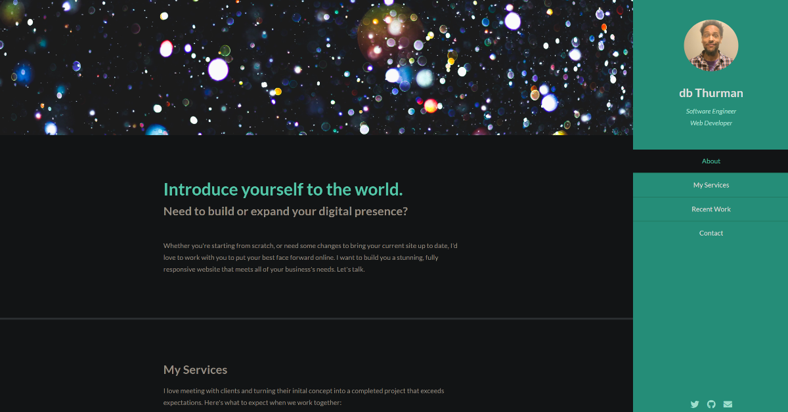

# Portfolio Website: <a target="_blank" href="https://dbthurman.netlify.app">Visit Here</a>
Portfolio site with links to my work and contact information.

        

## How It's Made:

**Tech used:** HTML, CSS, JavaScript

Here I'm mainly focused on a simple, smooth UI that looks good in dark and light modes and showcases my projects.

## Optimizations
I really want to make this even cleaner and add a few more animations (like scrolling preview images).

## Lessons Learned:

This was my first experience in deploying a website, so it was great to see that process unfold first hand. I learned a lot about css placement and how to generate and style icons.
